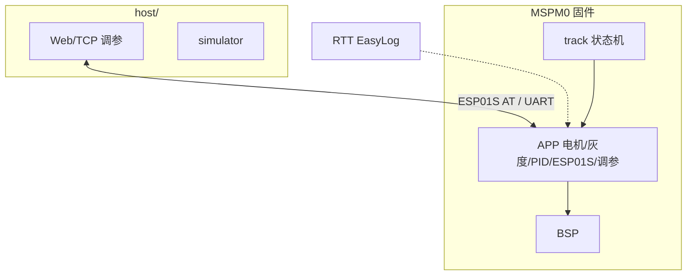
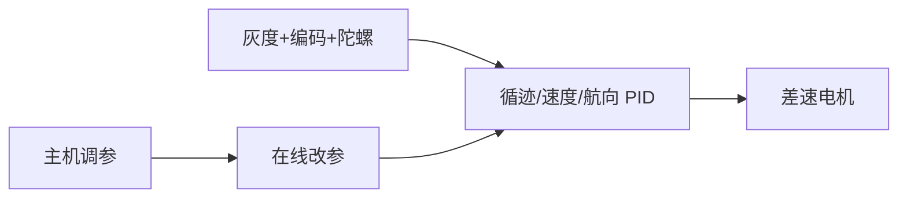

# Mspm0_Track_Car

MSPM0G3507 循迹车完整工程：固件（灰度/编码器/MPU/ESP01S）+ 主机调参端（host TCP/Web）。

## 系统架构图

```mermaid
flowchart TB
  subgraph MCU[MSPM0 固件]
    TR[track 状态机]
    APP[APP 电机/灰度/PID/ESP01S/调参]
    BSP[BSP]
    TR --> APP --> BSP
  end
  subgraph Host[host/]
    WEB[Web/TCP 调参]
    SIM[simulator]
  end
  WEB <-->|ESP01S AT / UART| APP
  RTT[RTT EasyLog] -.-> APP
```

## 功能框图

```mermaid
flowchart LR
  SEN[灰度+编码+陀螺] --> CTRL[循迹/速度/航向 PID]
  CTRL --> MOT[差速电机]
  HOST[主机调参] --> TUN[在线改参]
  TUN --> CTRL
```

## 远程

origin → https://github.com/linxi27667/Mspm0_Track_Car.git
